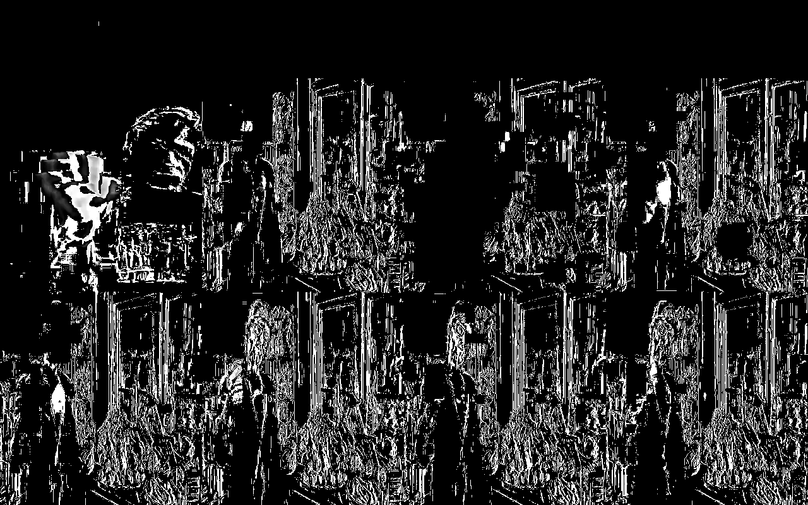

# vtools: A set of video tools

## 1. vtools-entropy.py

This tool calculates the difference of every pair of consecutive frames in a video file. The difference is measured as both MSE ([Mean Squared Error](https://en.wikipedia.org/wiki/Mean_squared_error)) and the logarithm in base 10 of the MSW. The goal is to allow finding videos that repeat frames. 

Example:

```
$ ./python/vtools-entropy.py input.mjpeg.mkv 
frame1,frame2,mse,log10_mse
0,1,0.00012605369709156177,-3.8994444121619263
1,2,4.7327327728271485e-05,-4.324888016673559
2,3,0.0001901730113559299,-3.7208511164777636
3,4,0.0001704941937952866,-3.7682904063817717
4,5,0.0,-inf
5,6,0.00011581549585601429,-3.9362333290841827
6,7,0.00010921957934344258,-3.9616995004719042
7,8,0.00012116852866278754,-3.916610165672386
8,9,0.00017747575265389902,-3.750860973357819
9,10,0.00028115921373720524,-3.55104767985986
10,11,0.0,-inf
11,12,0.000544595906763901,-3.263925627183589
12,13,0.00033712159027287985,-3.472213433073459
13,14,9.747378737838181e-05,-4.011112158942266
14,15,8.840158250596788e-05,-4.053539960468173
15,16,0.00015276589217009368,-3.8159735992669805
16,17,0.0,-inf
17,18,0.00022149942774831512,-3.654627391454772
18,19,0.00014725339088910892,-3.8319346956751703
19,20,0.00021108081134749046,-3.675551245160724
20,21,1.83719058095673e-05,-4.735845789821174
21,22,0.00011078826645274222,-3.955506233151503
22,23,0.0,-inf
23,24,0.00014770162841420116,-3.830614716553973
24,25,0.0002738358097311891,-3.56250975944623
25,26,0.0002722235538341381,-3.565074300669636
26,27,0.00012955295539196626,-3.8875526753390375
27,28,0.00017614798957918897,-3.754122309165379
28,29,0.0,-inf
29,30,0.00047675515163091966,-3.321704605439181
...
```

Note the video duplicates a frame every 6 frames.

Script allows producing a video showing the differences between consecutive
frames, using black to represent "no difference between the pixels in the
consecutive frames", and white to represent "maximum difference".


```
$ ./python/vtools-entropy.py --dump-file /tmp/diff.mp4 input.mjpeg.mkv
...
```



Figure 1 shows a frame from a diff video (dump-file). 


# Appendix 1: Prerequisites

The vtools-player.py script requires installing both [ffmpeg-python](https://pypi.org/project/ffmpeg-python) and [ffprobe-python](https://pypi.org/project/ffprobe-python)


```
# pip install ffmpeg-python
# pip install ffprobe-python
```

These packages naming collides with the following packages, which must be removed:
```
# pip uninstall ffmpeg
# pip uninstall python-ffmpeg
# pip uninstall ffprobe
```
